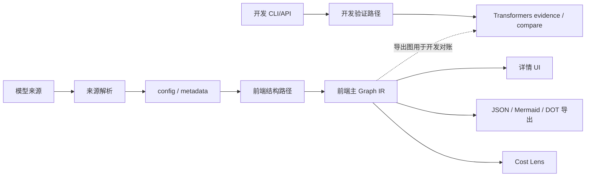

# 系统架构

## 定位

Model Structure Viewer（MSV）是一个轻量的模型结构查看和理论成本分析工具。它读取模型配置、公开元数据和 safetensors header，生成可解释的结构、公式、理论显存和瓶颈信息；不下载权重数据，不运行推理，也不承担在线 serving、调度或 TTFT/TPOT/吞吐等服务指标预测。可选的 runtime evidence 只作为带 fingerprint 的离线证据导入，不改变 MSV 的静态产品边界。Roofline 瓶颈与理论时间下界属于估计，必须标明"下界"，不得当成服务指标。

## 总体数据流



产品前端来源为 `builtin`、`hf` 和浏览器文件对应的 `config`。旧 `auto` 只按内置→远程解析；旧 `local` 提示重新选择目录。页面不请求 MSV `/api/*`，没有验证入口或后端状态探测。本地目录使用浏览器 File API，搜索与远程读取直连公开 Hub。Python CLI/API 的磁盘缓存、来源解析与验证契约独立保留。

## 前端结构路径

```text
config.json + safetensors header
  -> config/normalize
  -> registry/resolveArchitecture
  -> models
  -> layers
  -> operators (ops + formulas)
  -> Graph IR v2 (nodes + hierarchy + explicit dataflow edges)
  -> materializers/modelStructure
  -> UI / export / cost analysis
```

前端是产品唯一运行路径。配置归一化只负责统一字段，registry 只负责架构识别，model builder 负责顶层组网，layers/ops 负责结构和算子语义，IR 负责稳定边界，UI 不直接依赖 builder 内部对象。

## 后端路径

```text
CLI / HTTP request
  -> resolver / local cache / HF client
  -> config and remote-code recovery
  -> transformers meta-device introspection
  -> Transformers module evidence（非产品 Graph）
  -> compare 与前端 Graph 对账
  -> API / CLI / export
```

后端用于本地配置读取、远程配置读取、CLI/API 和 Transformers 结构验证。前端
Graph 是 MSV 的主事实源；后端不生成第二份产品结构，而是返回 Transformers
module evidence，由 compare 层与前端 Graph 对账。`root` 进入退役流程，不再是
共享协议或新功能的兼容对象。后端默认面向可信的本地开发环境；
`trust_remote_code=True`、本地路径和进程级 settings 都不是公网多租户安全边界。

## 共享协议

前后端通过 `StructureNode` / `ModelStructure` 语义共享以下信息：

- 模型摘要和规范化配置
- 节点树、重复层、输入输出 shape
- `graph.schema_version=2`、节点事实、canonical node ids、稳定 path 节点和显式 dataflow edges
- 参数量、dtype、权重来源和 tensor 名称
- 算子、公式、诊断和结构生成策略

`graph` 是唯一内部事实载体。后端 introspection 产出 Transformers evidence，
不再与前端 recipe 竞争产品结构事实。前端搜索、选择、breadcrumb、layout、
compute、aggregate、通信、PP/PD projection 和导出只消费 graph。`root` 不属于
共享协议，旧消费者必须迁移到 graph 后删除。

## 版本边界

- 前端 IR `version: 3`（`frontend/src/structure/ir/createStructureIr.js`）是**前端内部演进版本**，只约束前端内消费者；
- Graph `schema_version: 2`（前端 `materializeStructureGraph.js` 与后端 `schemas.py` 同值）是**前后端共享协议版本**，升版需两侧同步；
- 两者语义不同、独立演进，不做字段合并（无 oracle 收益，登记为决策——route-closeout P9，2026-09-10）。

## 责任边界

| 区域 | 负责 | 不负责 |
|---|---|---|
| `frontend/src/structure` | 配置归一化、架构映射、结构组网、公式和 IR | 真实 kernel、推理、调度 |
| `frontend/src/cost` | 理论内存、MACs、roofline 下界、并行和 PD 投影 | 性能仿真、TTFT/TPOT/吞吐、实测校准 |
| `frontend/src/diagram` | React Flow 图、布局、交互和联动 | 模型结构推断 |
| `src/model_structure_viewer` | API、CLI、本地缓存、HF 解析和 transformers 验证 | 前端交互和公网安全治理 |
| `models/` | 内置配置、catalog 和可信后端验证所需的轻量代码 | 权重文件和推理运行 |

## 相关文档

- 模块、公式和 IR：[`details/modules.md`](details/modules.md)
- 模型来源、catalog 和发布时间：[`details/models.md`](details/models.md)
- UI 行为：[`ui_interaction.md`](ui_interaction.md)
- 纯前端边界与实现参考：[`frontend_boundary.md`](frontend_boundary.md)
- 测试与发布：[`testing_release.md`](testing_release.md)
- 变更历史：通过 Git 提交记录追溯；当前实现计划见 [`implementation_plan.md`](implementation_plan.md)
