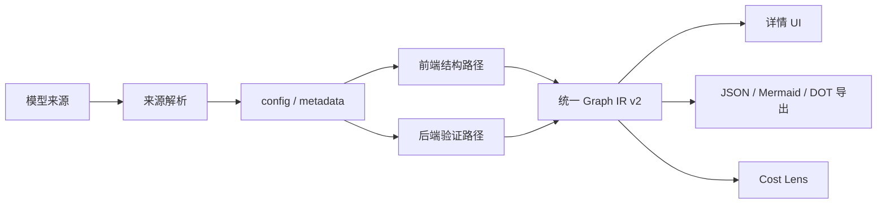

# 系统架构

## 定位

Model Structure Viewer（MSV）是一个轻量的模型结构查看和理论成本分析工具。它读取模型配置、公开元数据和 safetensors header，生成可解释的结构、公式、显存和瓶颈信息；不下载权重数据，不运行推理，也不承担在线 serving、调度或吞吐预测。

## 总体数据流



模型来源包括 `builtin`、`local`、`hf`、`auto` 和 `config`。`auto` 是 CLI/API 的兼容 fallback 模式；前端入口展示明确的远程端点选择。前端静态部署优先使用 `builtin`、`config` 和公开远程来源；本地目录、后端代理、settings 和 transformers 验证需要 API。

## 前端结构路径

```text
config.json + safetensors header
  -> config/normalize
  -> registry/resolveArchitecture
  -> model_executor/models
  -> model_executor/layers
  -> model_executor/ops + formulas
  -> Graph IR v2 (nodes + hierarchy + explicit dataflow edges)
  -> materializers/toStructureNode
  -> UI / export / cost analysis
```

前端是静态部署的主要路径。配置归一化只负责统一字段，registry 只负责架构识别，model builder 负责顶层组网，layers/ops 负责结构和算子语义，IR 负责稳定边界，UI 不直接依赖 builder 内部对象。

## 后端路径

```text
CLI / HTTP request
  -> resolver / local cache / HF client
  -> config and remote-code recovery
  -> transformers meta-device introspection
  -> Graph IR response
  -> API / CLI / export
```

后端用于本地配置读取、远程配置读取、CLI/API 和 transformers 结构验证。后端默认面向可信的本地开发环境；`trust_remote_code=True`、本地路径和进程级 settings 都不是公网多租户安全边界。

## 共享协议

前后端通过 `StructureNode` / `ModelStructure` 语义共享以下信息：

- 模型摘要和规范化配置
- 节点树、重复层、输入输出 shape
- `graph.schema_version=2`、节点事实、canonical node ids、稳定 path 节点和显式 dataflow edges
- 参数量、dtype、权重来源和 tensor 名称
- 算子、公式、诊断和结构生成策略

`graph` 是唯一内部事实载体；`root` 是由 graph projection 生成的兼容层。后端 introspection 通过 `GraphDraft` 直接写入节点事实和层级边，前端搜索、选择、breadcrumb、layout、compute、aggregate、通信、PP/PD projection 和导出优先消费 graph。新功能不应把 `root.children` 当作事实源。

## 责任边界

| 区域 | 负责 | 不负责 |
|---|---|---|
| `frontend/src/structure` | 配置归一化、架构映射、结构组网、公式和 IR | 真实 kernel、推理、调度 |
| `frontend/src/cost` | 理论内存、MACs、roofline、并行和 PD 投影 | 性能仿真、吞吐预测、实测校准 |
| `frontend/src/diagram` | React Flow 图、布局、交互和联动 | 模型结构推断 |
| `src/model_structure_viewer` | API、CLI、本地缓存、HF 解析和 transformers 验证 | 前端交互和公网安全治理 |
| `models/` | 内置配置、catalog 和可信后端验证所需的轻量代码 | 权重文件和推理运行 |

## 相关文档

- 模块、公式和 IR：[`details/modules.md`](details/modules.md)
- 模型来源、catalog 和发布时间：[`details/models.md`](details/models.md)
- UI 行为：[`ui_interaction.md`](ui_interaction.md)
- 测试与发布：[`testing_release.md`](testing_release.md)
- 变更历史：通过 Git 提交记录追溯；当前实现计划见 [`implementation_plan.md`](implementation_plan.md)
