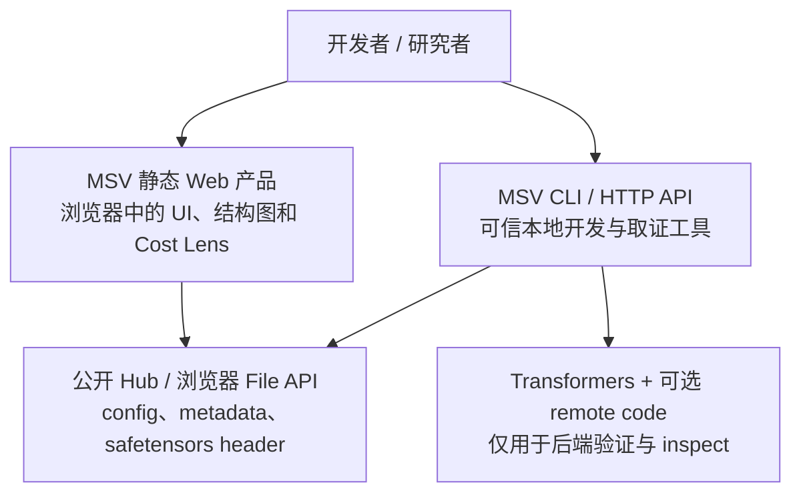
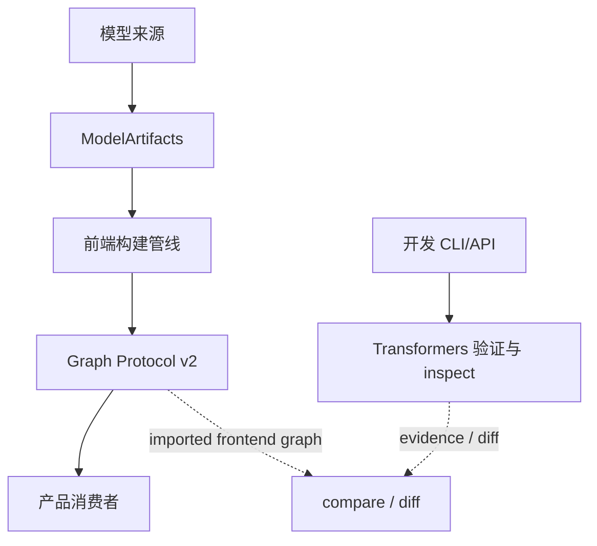
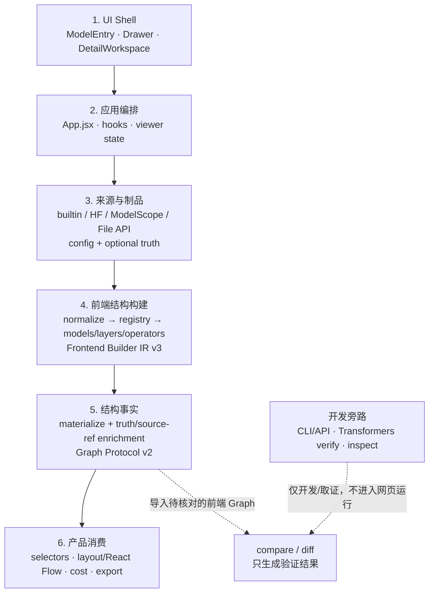
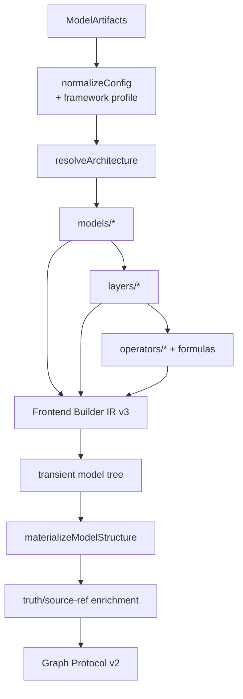
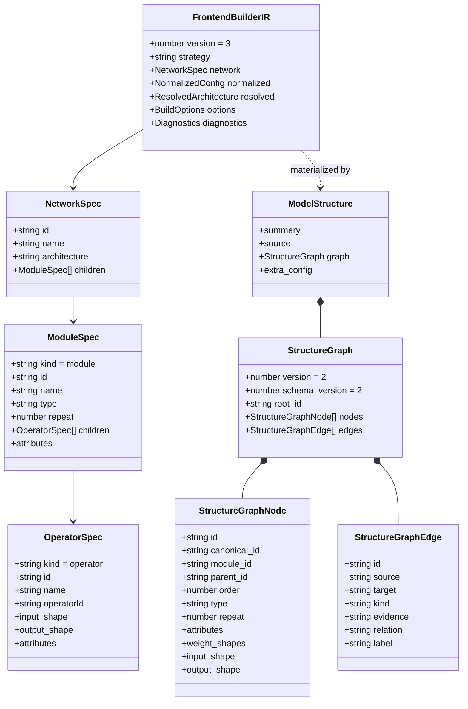

# 系统架构

## 定位

Model Structure Viewer（MSV）是一个轻量的模型结构查看和理论成本分析工具。它读取模型配置、公开元数据和 safetensors header，生成可解释的结构、公式、理论显存和瓶颈信息；不下载权重数据，不运行推理，也不承担在线 serving、调度或 TTFT/TPOT/吞吐等服务指标预测。可选的 runtime evidence 只作为带 fingerprint 的离线证据导入，不改变 MSV 的静态产品边界。Roofline 瓶颈与理论时间下界属于估计，必须标明"下界"，不得当成服务指标。

## 架构视图与阅读顺序

这份文档采用 C4 风格的“先边界、再运行路径、再协议”顺序，但不把
`ModelStructure`、builder 内部对象和 UI 组件混在一张图里：

| 视图 | 本文位置 | 回答的问题 |
|---|---|---|
| System context | 下图 | 谁使用 MSV，模型来源和开发工具在哪里 |
| Runtime / data flow | 总体数据流 | 一份模型制品如何变成可消费的结构图 |
| Container / component | 前端总体架构、后端路径 | 浏览器产品、构建管线和验证旁路分别负责什么 |
| Data / protocol | 共享协议、版本边界、数据模型 | 哪个对象是事实载荷，哪些只是中间态或视图投影 |
| Deployment / security | 后端路径末尾 | 静态网页和可信本地 CLI/API 的安全边界是什么 |

模型家族、算子公式和单个文件的调用关系不在本页展开，分别见
[`details/modules.md`](details/modules.md) 和 [`details/models.md`](details/models.md)。


```mermaid
flowchart TB
  USER["开发者 / 研究者"]
  WEB["MSV 静态 Web 产品<br/>浏览器中的 UI、结构图和 Cost Lens"]
  CLI["MSV CLI / HTTP API<br/>可信本地开发与取证工具"]
  SOURCES["公开 Hub / 浏览器 File API<br/>config、metadata、safetensors header"]
  TRANSFORMERS["Transformers + 可选 remote code<br/>仅用于后端验证与 inspect"]

  USER --> WEB
  USER --> CLI
  WEB --> SOURCES
  CLI --> SOURCES
  CLI --> TRANSFORMERS
```

网页产品和 CLI/API 是两个入口：网页直接读取公开来源，CLI/API 供开发者做本地
inspect、source-ref 采集和 `/api/verify` 对账。网页不把后端当作运行时依赖。

## 总体数据流


```mermaid
flowchart TB
  A[模型来源] --> B[ModelArtifacts]
  B --> C[前端构建管线]
  C --> D[Graph Protocol v2]
  D --> E[产品消费者]
  V[开发 CLI/API] --> W[Transformers 验证与 inspect]
  D -. imported frontend graph .-> X[compare / diff]
  W -. evidence / diff .-> X
```

产品前端来源为 `builtin`、`hf` 和浏览器文件对应的 `config`。输入首先被封装为
`ModelArtifacts`：配置是必需的，checkpoint truth、source-ref 和远程端点信息是
可选的；truth 可能来自离线 sidecar、浏览器/远程 safetensors header，也可能延迟
获取或不可用。旧 `auto` 只按内置→远程解析；旧 `local` 提示重新选择目录。页面不
请求 MSV `/api/*`，没有验证入口或后端状态探测。本地目录使用浏览器 File API，
搜索与远程读取直连公开 Hub。Python CLI/API 的磁盘缓存、来源解析和验证契约独立
保留。

## 前端总体架构

前端架构按“入口 → 编排 → 构建 → Graph → 消费”自顶向下组织。图中只保留稳定的
职责边界，具体模型分支和算子工厂见 [`details/modules.md`](details/modules.md)。


```mermaid
flowchart TB
  UI["1. UI Shell<br/>ModelEntry · Drawer · DetailWorkspace"]
  APP["2. 应用编排<br/>App.jsx · hooks · viewer state"]
  ARTIFACTS["3. 来源与制品<br/>builtin / HF / ModelScope / File API<br/>config + optional truth"]
  BUILD["4. 前端结构构建<br/>normalize → registry → models/layers/operators<br/>Frontend Builder IR v3"]
  GRAPH["5. 结构事实<br/>materialize + truth/source-ref enrichment<br/>Graph Protocol v2"]
  CONSUMERS["6. 产品消费<br/>selectors · layout/React Flow · cost · export"]
  DEV["开发旁路<br/>CLI/API · Transformers verify · inspect"]
  COMPARE["compare / diff<br/>只生成验证结果"]

  UI --> APP --> ARTIFACTS --> BUILD --> GRAPH --> CONSUMERS
  DEV -. 仅开发/取证，不进入网页运行 .-> COMPARE
  GRAPH -. 导入待核对的前端 Graph .-> COMPARE
```

### 前端结构路径


```mermaid
flowchart TB
  A["ModelArtifacts"] --> B["normalizeConfig<br/>+ framework profile"]
  B --> C["resolveArchitecture"]
  C --> D["models/*"]
  D --> E["layers/*"]
  E --> F["operators/* + formulas"]
  D --> G["Frontend Builder IR v3"]
  E --> G
  F --> G
  G --> H["transient model tree"]
  H --> I["materializeModelStructure"]
  I --> J["truth/source-ref enrichment"]
  J --> K["Graph Protocol v2"]
```

`models`、`layers` 和 `operators` 是组网期间的协作模块，不是三个严格串行的运行
时刻：builder 调用 layer，layer 调用 operator factory，operator factory 读取共享
的 shape、schedule 和 recipe 信息。`operators/ops/index.js` 当前仍是较大的组合工厂；
拆分它属于后续低风险重构，不改变 Graph 协议。

前端是产品唯一运行路径。`ModelStructure.graph` 是产品结构载荷；builder network、
transient model tree 和 Builder IR 只存在于构建过程，不被 UI 直接消费。

## 后端路径

```text
CLI / HTTP request
  -> resolver / local cache / HF client
  -> config and remote-code recovery
  -> transformers meta-device introspection
  -> backend Graph Protocol v2
  -> /api/structure or CLI inspect

imported frontend Graph + /api/verify request
  -> Transformers module evidence
  -> compare / diff
```

后端不参与网页运行。`/api/structure` 和 CLI `inspect` 仍然可以从
Transformers meta-device introspection 生成独立的 Graph Protocol v2，用于开发和取
证；`/api/verify` 则提取 module evidence 并与前端 Graph 对账。后端 Graph 不是网页
端的第二个运行时事实源，网页只消费前端 Graph。后端默认面向可信的本地开发环境；
`trust_remote_code=True`、本地路径和进程级 settings 都不是公网多租户安全边界。

## 共享协议

前后端共享的是 `ModelStructure.graph` 对应的 Graph Protocol，而不是
`StructureNode` 树。Graph 包含：

- `version=2`、`schema_version=2`、`root_id`
- 扁平节点、`parent_id`、`order`、`canonical_id` 和 `repeat`
- 输入输出 shape、参数/权重 shape、dtype、tensor names 和 attributes
- 带 `evidence` 的 dataflow edges

后端 `inspect` 可以复用相同的 Graph Protocol 形状，便于 CLI 输出和取证工具消费；
这表示“协议兼容”，不表示前后端共享同一份运行时对象，更不表示后端 Graph 会回写
前端产品 Graph。

树形 Layers、Inspector 和 breadcrumb 视图由 `graph/selectors.js` 按
`parent_id/order` 临时重建；它们不是独立事实载荷。Graph 边的 `evidence` 区分
`declared`、`module-order` 和 `shape-match`，不能把所有边都描述成 builder 显式声明。
`root` 不属于共享协议，旧消费者必须迁移到 graph 后删除。

## 版本边界

- **Frontend Builder IR v3**：`frontend/src/structure/ir/createStructureIr.js` 的
  `version: 3`，只描述前端构建过程，不是 API 或 Graph 协议版本；
- **Graph Protocol v2**：`version: 2` 与 `schema_version: 2`，由前端
  `materializeStructureGraph.js`、后端 `schemas.py` 和
  `details/models/source_contract.json` 共同约束，升版需同步三处；
- **Layout projection v1**：`diagram/layoutProjection.js` 等文件生成的虚拟 lane、
  frame 和 route 数据只属于视图层，不得写回 Graph。

三者语义独立，不做字段合并。

## Graph Protocol 数据模型

下面的 Mermaid `classDiagram` 只表示字段和聚合关系，不表示前端使用 JavaScript
class 实例；前端构建阶段使用 plain object，后端使用对应的 Pydantic models。


```mermaid
classDiagram
  class FrontendBuilderIR {
    +number version = 3
    +string strategy
    +NetworkSpec network
    +NormalizedConfig normalized
    +ResolvedArchitecture resolved
    +BuildOptions options
    +Diagnostics diagnostics
  }

  class NetworkSpec {
    +string id
    +string name
    +string architecture
    +ModuleSpec[] children
  }

  class ModuleSpec {
    +string kind = module
    +string id
    +string name
    +string type
    +number repeat
    +OperatorSpec[] children
    +attributes
  }

  class OperatorSpec {
    +string kind = operator
    +string id
    +string name
    +string operatorId
    +input_shape
    +output_shape
    +attributes
  }

  class ModelStructure {
    +summary
    +source
    +StructureGraph graph
    +extra_config
  }

  class StructureGraph {
    +number version = 2
    +number schema_version = 2
    +string root_id
    +StructureGraphNode[] nodes
    +StructureGraphEdge[] edges
  }

  class StructureGraphNode {
    +string id
    +string canonical_id
    +string module_id
    +string parent_id
    +number order
    +string type
    +number repeat
    +attributes
    +weight_shapes
    +input_shape
    +output_shape
  }

  class StructureGraphEdge {
    +string id
    +string source
    +string target
    +string kind
    +string evidence
    +string relation
    +string label
  }

  FrontendBuilderIR --> NetworkSpec
  NetworkSpec --> ModuleSpec
  ModuleSpec --> OperatorSpec
  FrontendBuilderIR ..> ModelStructure : materialized by
  ModelStructure *-- StructureGraph
  StructureGraph *-- StructureGraphNode
  StructureGraph *-- StructureGraphEdge
```

## 责任边界

| 区域 | 负责 | 不负责 |
|---|---|---|
| `frontend/src/structure` | 配置归一化、架构映射、结构组网、公式和 IR | 真实 kernel、推理、调度 |
| `frontend/src/cost` | 理论内存、MACs、roofline 下界、并行和 PD 投影 | 性能仿真、TTFT/TPOT/吞吐、实测校准 |
| `frontend/src/diagram` | React Flow 图、布局、交互和联动 | 模型结构推断 |
| `src/model_structure_viewer` | API、CLI、本地缓存、HF 解析和 transformers 验证 | 前端交互和公网安全治理 |
| `models/` | 内置配置、catalog 和可信后端验证所需的轻量代码 | 权重文件和推理运行 |

## 相关文档

- 模块、公式和 IR：[`details/modules.md`](details/modules.md)
- 模型来源、catalog 和发布时间：[`details/models.md`](details/models.md)
- UI 行为：[`ui_interaction.md`](ui_interaction.md)
- 纯前端边界与实现参考：[`frontend_boundary.md`](frontend_boundary.md)
- 测试与发布：[`testing_release.md`](testing_release.md)
- 变更历史：通过 Git 提交记录追溯；当前实现计划见 [`implementation_plan.md`](implementation_plan.md)
