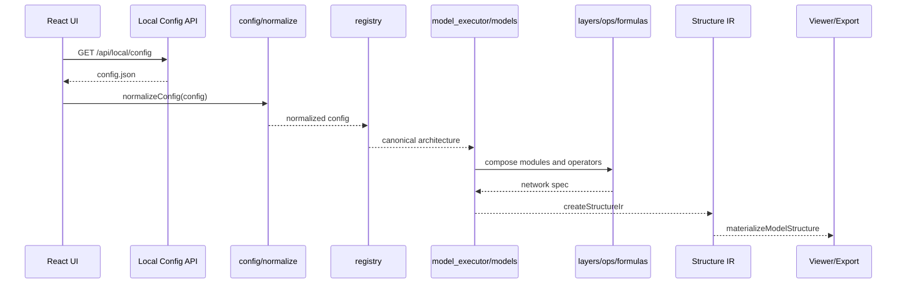
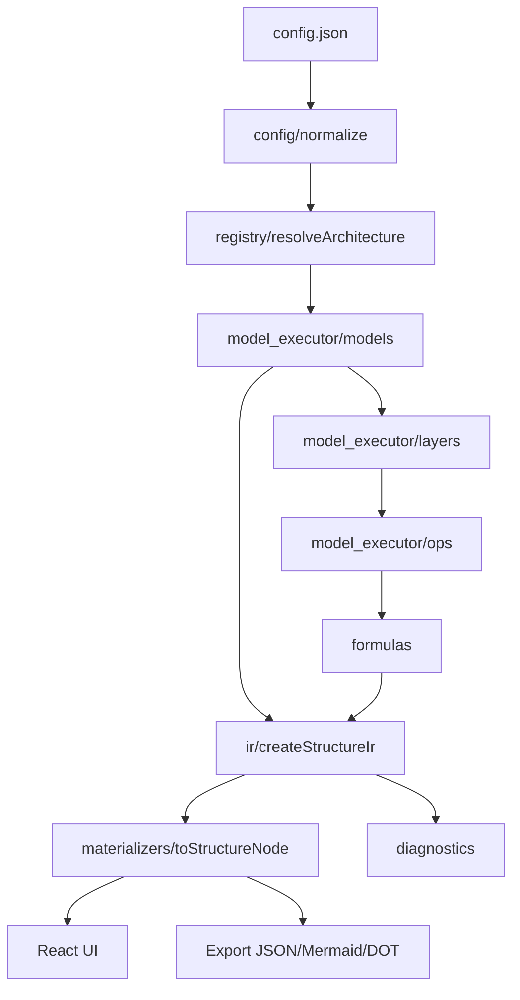

# 前端模型结构解析架构

## 目标

本项目的结构解析主链路固定为：

`config.json -> registry -> model builder -> layers -> ops/formulas -> IR -> UI/export`

后续新增模型时，优先只增加模型组网、层或算子公式。除非出现当前 IR 无法表达的新结构类型，否则不再做框架级重构。

## 参考边界

目录边界参考 vLLM 和 SGLang 的模型执行层组织方式：

- vLLM 通过 registry 把 Hugging Face `architectures` 映射到 `model_executor/models` 中的具体模型实现。
- SGLang 将 serving/runtime、model executor、models、layers、kernel/ops 分开管理。

本项目不执行推理，因此只复用“注册表、模型组网、通用层、算子语义”的边界，不引入 runtime scheduler、KV cache、真实 kernel 或权重加载。

## 目录结构

```text
frontend/src/structure/
  buildStructure.js
  config/
    normalize.js
  registry/
    aliases.js
    resolveArchitecture.js
  model_executor/
    models/
      index.js
      common.js
      deepseek.js
      generic.js
      minimax.js
      qwen.js
    layers/
      attention.js
      base.js
      decoderLayer.js
      decoderStack.js
      embedding.js
      mlp.js
      moe.js
      norm.js
      outputHead.js
      projector.js
      ranges.js
      vision.js
    ops/
      index.js
  formulas/
    index.js
  ir/
    createStructureIr.js
  materializers/
    toStructureNode.js
  diagnostics/
    collectDiagnostics.js
  catalog/
    manifest.js
```

## 模块职责

### `config`

读取原始 `config.json`，把不同厂商字段归一成统一字段，例如：

- `num_hidden_layers` / `n_layers` -> `layers`
- `hidden_size` / `dim` -> `hiddenSize`
- `num_attention_heads` / `n_heads` -> `attentionHeads`
- `n_routed_experts` / `num_local_experts` -> `experts`

它只做字段归一，不做模型结构判断。

### `registry`

负责把 `architectures[0]` 或 `model_type` 解析到 canonical architecture，例如：

- `DeepseekV3ForCausalLM` -> `mla-moe-decoder`
- `Qwen3_5MoeForConditionalGeneration` -> `gqa-moe-decoder`
- `MiniMaxM3SparseForConditionalGeneration` -> `multimodal-sparse-moe-decoder`

新增模型时，第一优先级是补 alias，而不是在 UI 或 layer 里写厂商判断。

### `model_executor/models`

表达顶层组网，相当于 vLLM/SGLang 中的 model 文件。它决定模型由哪些大模块组成：

- text decoder: embedding -> decoder stack -> final norm -> lm head
- multimodal sparse MoE: vision tower -> projector -> text decoder -> lm head
- generic decoder: decoder stack

新增模型如果只是已有结构的参数变化，应只新增或复用这里的 builder。

### `model_executor/layers`

表达可复用层级模块：

- Attention
- DecoderLayer
- DecoderStack
- MLP
- RoutedMoE
- RMSNorm
- Embedding
- VisionTower

这里不关心 UI 展示，也不读取原始 config，只消费 `normalizeConfig` 的结果。

### `model_executor/ops`

表达最底层算子语义，不对应真实 kernel 实现。当前算子包括：

- `linear`
- `matmul`
- `softmax`
- `rope`
- `rmsnorm`
- `swiglu`
- `topk`
- `moe_dispatch`
- `moe_combine`

如果未来要展示 MLA、shared expert、MTP、vision patch embedding 等更细算子，应优先在这里扩展。

### `formulas`

维护算子到公式、输入输出、中文说明的映射。UI 只消费 formula metadata，不在组件中硬编码公式。

### `ir`

创建稳定中间表示，包含：

- `network`
- `normalized`
- `resolved`
- `diagnostics`
- `strategy`

IR 是后续前端纯静态部署的核心边界。UI、导出、验证都应消费 IR materialize 后的结构，不直接调用 registry 或 layers。

### `materializers`

把 IR 转换成当前 UI 使用的 `ModelStructure` / `StructureNode` 协议。这样 UI 不需要理解模型 builder 的内部结构。

### `diagnostics`

收集解析路径、fallback、unsupported、operator count 等机器可读诊断信息。系统验证依赖这些字段判断是否有模型走了非预期路径。

### `catalog`

管理可内置或预验证模型清单。当前保留 manifest 解析能力，后续 GitHub Pages 部署时可以把官方 config 索引静态化。

## 时序图



## 架构图



## 新模型适配流程

1. 在 `registry/aliases.js` 添加官方 architecture alias。
2. 如果能复用现有 canonical architecture，不新增 builder。
3. 如果顶层组网不同，在 `model_executor/models/` 新增 builder，并在 `models/index.js` 注册。
4. 如果只是局部层不同，在 `model_executor/layers/` 新增或扩展 layer。
5. 如果需要展示新算子，在 `model_executor/ops/` 和 `formulas/` 同时新增。
6. 添加单元测试，至少覆盖 alias、builder 输出、公式映射和 materialized structure。
7. 用真实本地 config 做系统验证，确认无 crash、无 unsupported，diagnostics 可解释。

## 冻结规则

- `ir/`、`materializers/` 和 UI 数据协议默认冻结。
- 新模型适配优先提交 `registry`、`models`、`layers`、`ops`、`formulas`。
- 只有当前 IR 无法表达新的模型拓扑时，才允许重新讨论架构。
